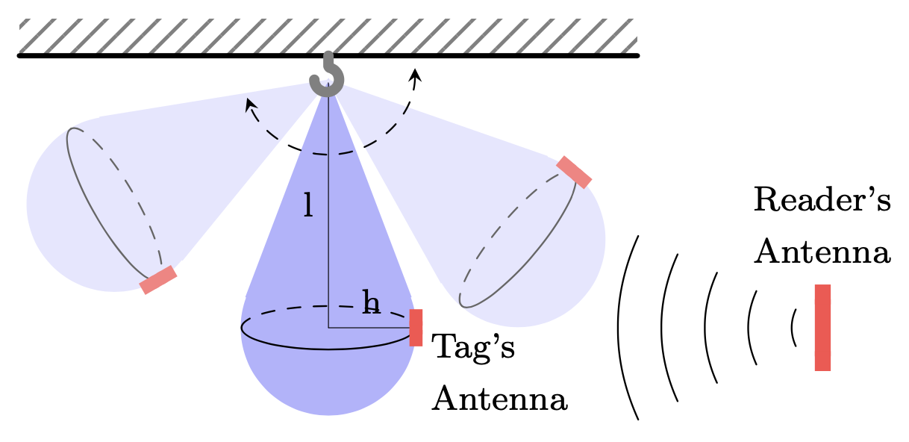

# Phase-based UHF RFID approach for speed bag monitoring
This repository contains the materials used in the study 

<!--
Pablo López-Matencio, Javier Vales-Alonso, and Enrique Costa-Montenegro, “ANT: Agent Stigmergy-Based IoT-Network for Enhanced Tourist Mobility,” *Mobile Information Systems*, vol. 2017, Article ID 1328127, 15 pages, 2017. https://doi.org/10.1155/2017/1328127
-->

> **P. López-Matencio, F. J. González-Castaño and J. Vales-Alonso**
> "Phase-based UHF RFID approach for speed bag monitoring," 
> *2022 7th International Conference on Smart and Sustainable Technologies (SpliTech)*
> Split / Bol, Croatia, 2022, pp. 1-4, 
> [https://doi.org/10.23919/SpliTech55088.2022.9854229](https://doi.org/10.23919/SpliTech55088.2022.9854229)

This work presents a new RFID-based application for sports activity monitoring.
Specifically, the developed system aims to detect a boxing speed bag's periodic pattern of movements during a training session.

## Operation overview
A speed bag is a light, air-filled, and small drop-shaped punching that may be anchored to the ceiling 
or a top-placed rebound platform

  
  
<b>Figure 1:</b> Speed bag RFID-based system scheme.

A typical workout with a speed bag may attack the bag for about 3 or 5 minutes and rest for one minute between rounds.
The boxer has to repeatedly hit the bag during the session and use one or two hands while the bag moves fast.
Therefore, the boxer must be very focused on the exercise and coordinate eye and hand movements to keep the speed of the bag.
Monitoring the speed of the bag is challenging because the data must be obtained without hindering the execution of the exercise and without distracting the boxer.
In our system, we are able to compute the oscillation frequency interrogating a passive tag attached to the bag. 

## Model approach
We assume the speedbag is in motion and the RFID antennas, TX and RX, are in the same plane.

The computation of the oscillation freequency is made thorugh the phase of the backscattered signal received in the reader's antenna. The Jupyter notebook `LOSS_SPLIT.ipynb` models the communication channel, the link budget (losses of the backscattered signal), and the phase and frequency of the received signal.

The following table contains the main parameters of out system model:

| **Parameter**                                   | **Description**                                                                   |
|-------------------------------------------------|-----------------------------------------------------------------------------------|
| Frame interrogation protocol                   | FSA [ISO18000] with frame length 1 slot                                          |
| Initial distance between Tx-Rx antennas ($d_0$)| in [1,10] m (at $\psi(t){=}\psi_0$ position)                                     |
| Reader antenna                                 | Patch panel (gain of 8 dBi)                                                      |
| Reader's antenna tilt ($\theta_1$)             | Aimed to the center of the tag's antenna                                         |
| Tag's antenna tilt ($\theta_2$)                | Aimed to the center of the reader's antenna                                      |
| Antenna azimuth                                | 0, the tag's and reader's antennas are in a plane                                |
| Tag antenna                                    | Half-wave dipole (gain of 2 dBi)                                                 |
| Tag power-up threshold ($\text{IC}_{th}$)      | -19 dBm                                                                          |
| Reader sensitivity threshold ($\text{S}_{th}$) | -80 dBm                                                                          |
| Frequency                                      | 865.7 MHz                                                                        |
| Transmission power                             | 27 dBm                                                                           |
| Backscatter-Link Frequency (BLF)              | 320 kHz                                                                          |
| Noise level                                    | -120.87 dBm                                                                      |
| Channel model                                  | Line-of-sight with Rician fading                                                 |
| Rician K-factor                                | 3 dB                                                                             |
| Tag attached material                          | Plastic                                                                          |
| Tag modulation factor                          | 0.25                                                                             |
| On object gain penalty                         | 1.1 dB                                                                           |
| Vertical distance of the tag to the hook ($l$)| 22 cm                                                                            |
| Radius of the speedbag at tag's height ($h$)   | 27/π ≈ 8.6 cm                                                                    |
| Angle of the tag's antenna with $x-\text{axis}$ ($\psi_0$)| 21.34°                                                            |
| Mean oscillation frequency of the speedbag ($f$)| 4 Hz                                                                             |
| Time between tag's readings ($T_\text{reader}$)| 1/35 s                                                                           |
| EPC length                                     | 96 bits                                                                          |
